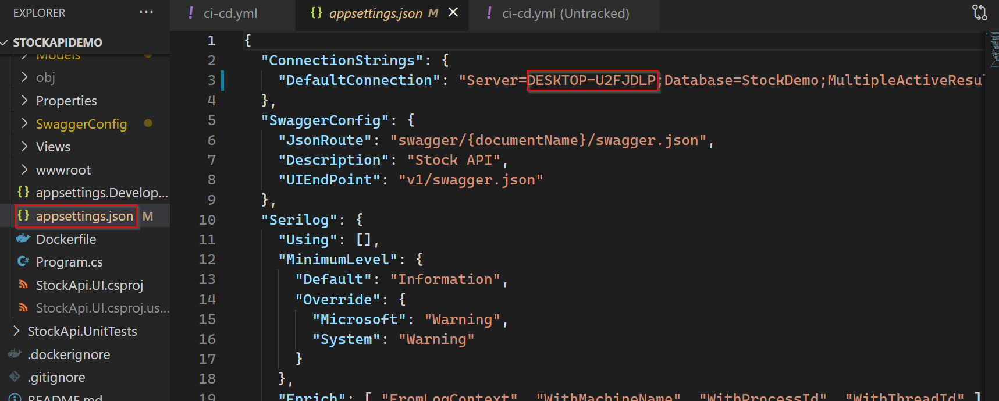
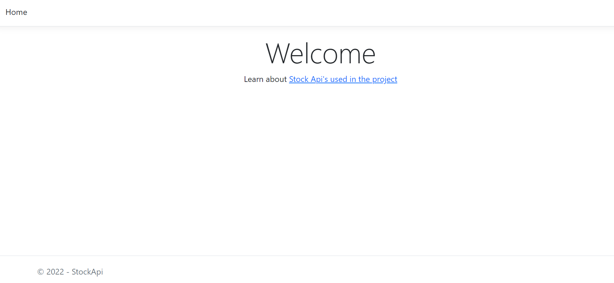
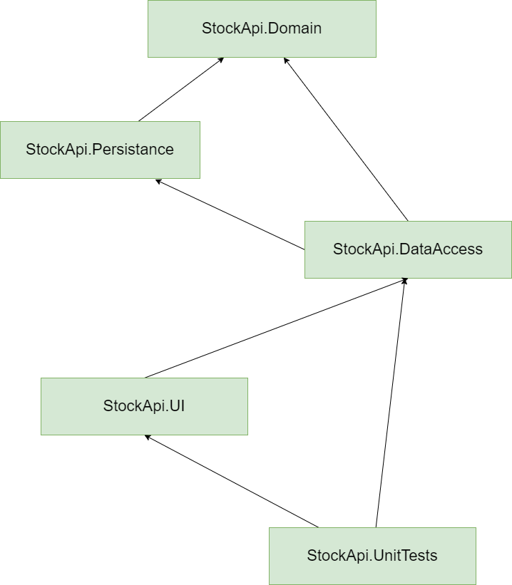
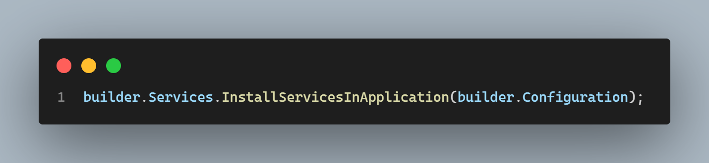
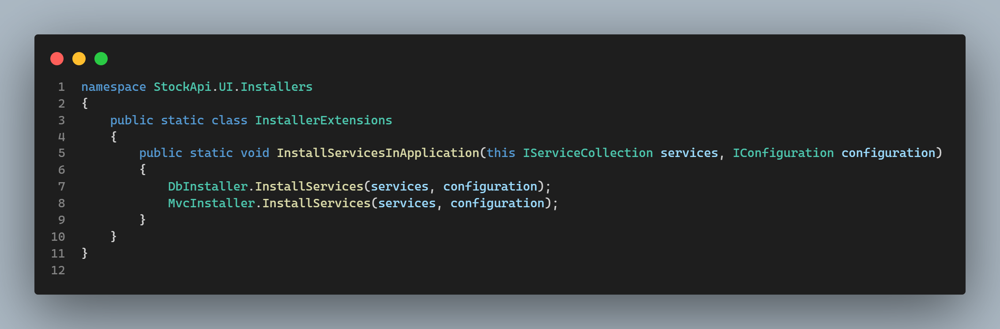
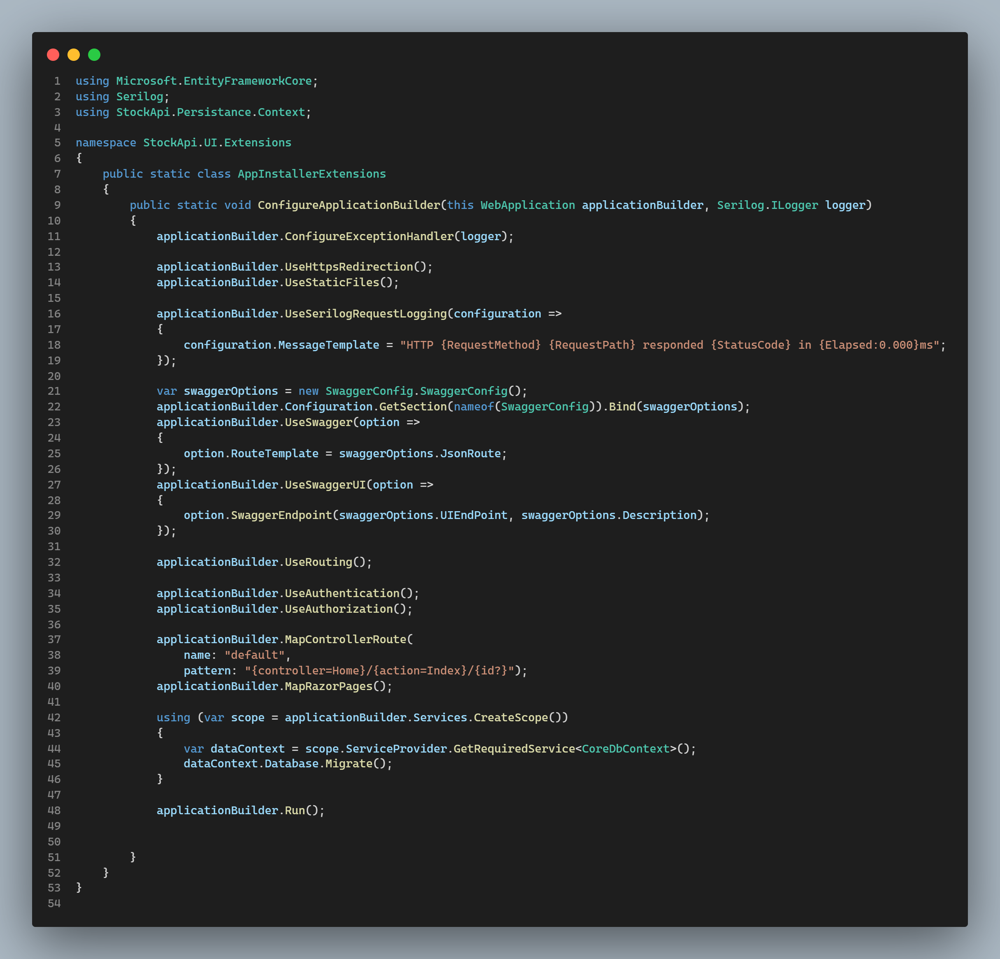
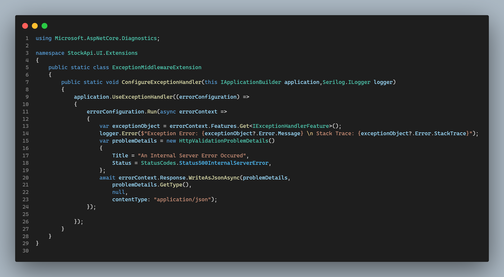

# StockApiDemo

A simple web api project build on .net 6

# How To Use

- ***Requires .NET 6 Runtime***
- ***Requires MS SQL Server on your local machine***

- `git clone https://github.com/Varghese-1987/StockApiDemo.git`
- Once cloned make sure to change the appsettings.json file to point to the correct Sql Server and update the credentials as well as shown below

- Above step is required because as soon as the application launches it will try to run the EF core migrations and create the relevant tables for the application.
- Once the application runs successfully , you should be seeing the following page
- You may have to create some data with the post endpoint as there is no seed data by default.

- Click on the Stock Api link the home page to naviagte to the swagger doc of the project api's

# Project Dependency Diagram

- The project dependencies are structured as shown in the diagram below

# Application Configuration Breakdown

- The following instructions are to ensure that the reader gains a better understanding of how the code is structured.

## Breakdown of program.cs

- With the introduction of .net 6 the program.cs is written in the minimal api style which is totally different from the previous .net core versions
- First thing in this file is the configuration of third party logging library Serilog to provide structured logging
- Second is the configuration of services which is abstracted out to an InstallerExtensions class as shown below

- Third is the configuration of middleware which is also abstracted out to an AppInstallerExtensions.cs as shown below

- Exception middleware configuration is also abstracted out to ExceptionMiddlewareExtension.cs as shown below

## Other Main Configurations in StockApi.UI
- Swagger configuration
- Model validation leveraging on the FluentValidation library and ApiModelValidationFilter.cs
- ApiRoutes are stored in ApiRoutes.cs
- It has a project dependency only on StockApi.DataAccess
- Services from StockApi.DataAccess are injected via built in dependency injection configuration

## Main Configurations in StockApi.DataAccess
- Core Api Buisness logic resides inside this project
- Leverages on the FluentValidator library to implement validation of ViewModels
- This project has a dependency on StockApi.Domain and StockApi.Persistance projects

## Main Configurations in StockApi.Persistance
- DbContext configuration resides in this project
- Entity validations leveraging on the EF core fluent api are also defined here
- Database migrations are in this project
- This project has a dependency on StockApi.Domain

## Main Configurations in StockApi.Domain
- Core Entites are defined in this project
- This is the lowest dependency and this project is at the top of the dependency chain

## Main Configurations in StockApi.UnitTests
- Unit tests are defined in this project
- This project has a dependency on StockApi.UI and StockApi.DataAccess projects

## Main Configurations of CI/CD
- This is defined inside in ci-cd.yml file which resides in the  .github\workflows folder

